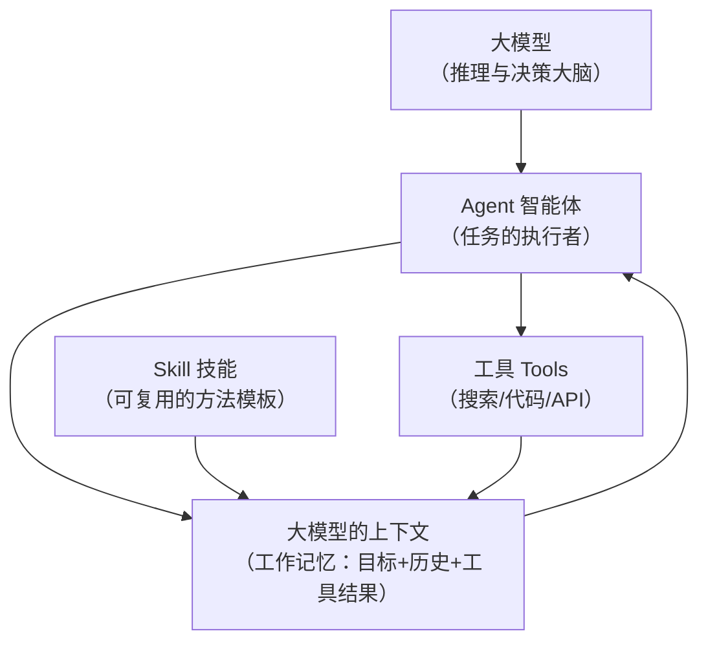

# 概念关系说明：Agent · 大模型的上下文 · Skill

> 本文档说明「Agent」「大模型的上下文」「Skill」三个概念之间的关系。
> 重点回答两个问题：**上下文如何影响 Agent 的工作**、**Skill 如何沉淀可复用的任务知识**。

---

## 一、一句话总览

这三个概念描述的是「一个会执行任务的 AI 系统」的不同侧面：

| 概念 | 回答的问题 | 角色 |
|------|-----------|------|
| **Agent（智能体）** | 谁来干、怎么自主地干 | 任务的**执行者** |
| **大模型的上下文（Context）** | 它此刻"看得到"哪些信息 | 执行的**工作记忆** |
| **Skill（技能）** | 有没有一套可复用的"干法" | 执行的**方法模板** |

---

## 二、三者的关系图（Mermaid）



**读图要点**：
- **M（大模型）** 是 Agent 的"大脑"，负责推理与决策。
- **C（上下文）** 是 Agent 的"工作记忆"——Agent 每走一步，都要把新看到的工具结果/历史写回上下文，再据此决策。
- **S（Skill）** 是"方法模板"——运行时被读进上下文，告诉 Agent"这类事该怎么做"。
- **T（工具）** 是 Agent 的"手脚"，能让模型真正行动，而工具结果又成为上下文的一部分。

---

## 三、重点一：上下文如何影响 Agent 的工作

### 3.1 上下文是 Agent 的"全部视野"

Agent 本质上是"大模型在循环里做决策"。它每次决策所依据的一切，都来自**上下文窗口**：

```
Agent 单次决策的输入 = 
   System 指令 
 + 用户目标 
 + 历史对话/步骤 
 + 工具返回结果 
 + （运行时注入的）Skill 规范
```

换句话说：**Agent 只能基于上下文里的信息作判断**。上下文里没有的东西，它"看不见"，也就无法利用。

### 3.2 影响体现在 4 个方面

| 影响维度 | 说明 | 后果 |
|---------|------|------|
| **信息可用性** | 关键信息没进上下文 → Agent 无从利用 | 任务失败或答非所问 |
| **决策依据** | 上下文决定 Agent 下一步"该干嘛" | 上下文不准 → 决策链跑偏 |
| **注意力分配** | 长上下文"中间"信息易丢（Lost in the Middle） | 重要结论埋在中间会被忽略 |
| **约束遵守** | 通过指令约束 Agent 行为（如"必须核查来源"） | 靠上下文里的规范才能约束住 Agent |

### 3.3 结论

> **上下文是 Agent 的"工作记忆"，直接决定 Agent 每次决策的质量与边界。**
> 做好上下文工程（放对位置、先检索、控制长度），Agent 才能稳定可靠地完成任务。

---

## 四、重点二：Skill 如何沉淀可复用的任务知识

### 4.1 "一次性提示词" → "可复用 Skill"的跃迁

| 维度 | 一次性提示词 | 沉淀成的 Skill |
|------|------------|---------------|
| 复用性 | 每次重写 | 一次沉淀、反复使用 |
| 完整性 | 容易遗漏模块 | 结构化、有自检 |
| 可校准 | 改一处要全局动 | 改 Skill 一处即可 |
| 团队/跨会话 | 无法传递 | 可存仓库、同事共享 |
| 价值 | 一次性劳动 | **可积累的任务知识资产** |

### 4.2 Skill 沉淀知识的机制（以本项目 `concept-learning-generator` 为例）

```
用户: "用 XX Skill 学习「Agent」"
        │
        ▼
① 系统读取仓库里 .workbuddy/skills/concept-learning-generator/SKILL.md
        │  （YAML 元数据 + 场景/输入/步骤/输出/来源/自检）
        ▼
② 该 Skill 内容被注入到 Agent 的上下文
        │
        ▼
③ Agent 依据它执行: 生成学习目标→核心问题→结构化解释→应用案例→概念辨析→自测题→参考来源
        │
        ▼
④ 产出符合规范的学习资料（HTML），并完成来源与自检核查
```

### 4.3 关键理解

- **Skill 把"怎么做好一类任务"的隐性经验 → 显性化成可读取的规范**，这正是"知识沉淀"。
- Skill 静态地存在磁盘上，**只有被读进上下文后才会对 Agent 生效**——所以 Skill 依赖上下文这个"载体"。
- 好的 Skill 是**通用的**：它描述"一类任务的方法"，而不是"某一次正好这样写"。所以换成学 `Transformer`，流程依然成立。

---

## 五、三者的完整协作模型

```
       Skill（方法模板）—— 平时安心躺在仓库里，像一本"操作手册"
              │ 需要时被读取、注入
              ▼
      上下文（工作记忆）—— Agent 每次决策时"看得见"的全部信息
              │ 作为输入
              ▼
       Agent（执行者）—— 大模型在循环里自主决策、调工具、看反馈、再调整
              │ 产生结果
              ▼
       完成任务 + 产出 → 又可以沉淀成新的 Skill / 写回记忆
```

---

## 六、总结（三句话）

1. **Agent + 上下文 + Skill 一起，才构成一个"能干活的智能系统"。**
2. **上下文是主线**：它是 Agent 的视野与工作记忆，决定每次决策质量；Skill 也是通过"进入上下文"才对 Agent 生效。
3. **Skill 是沉淀**：把一次次尝试固化成可复用的规范，让任务知识能积累、能复用、能传承。

---

*本文档由概念学习资料生成器（`concept-learning-generator`）生成，经人工核查修改。*
